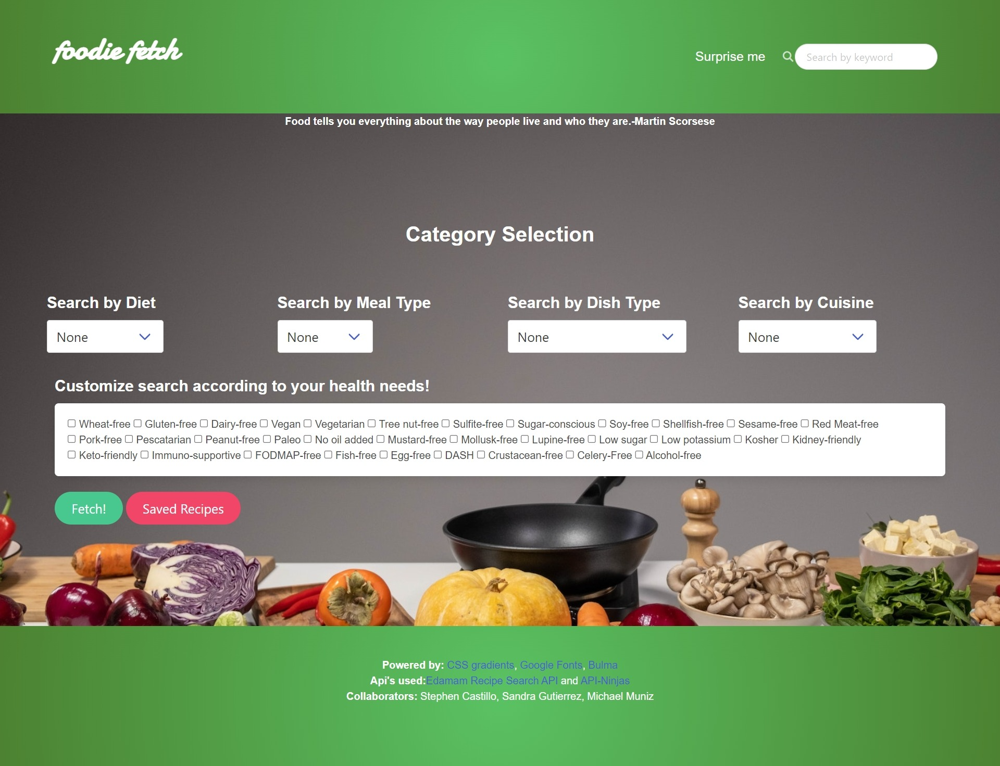
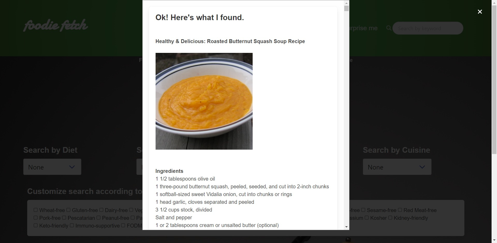

# Foodie-Fetch

## Description

An application that allows users to find recipes based on culinary preferences and dietary restrictions.  

User Story:

AS A person who likes to cook  
I WANT to easily find recipes according to my specifications  
SO THAT I can have multiple options for every occasion

## Table of Contents

- [Usage](#usage)
- [Credits](#credits)
- [License](#license)

## Usage

You can access the Foodie Fetch site by clicking this link: https://stephen-castillo.github.io/Foodie-Fetch/   

To get started, choose the manner in which you wish to search for recipes. The navigation bar at the top provides a randomizer button and a search bar. If you're feeling spontaneous, you may click on the "Surprise me" button to retrieve (a) random recipe(s). The number of recipes you receive will vary each time you use the "Surprise me" button. You may search by keyword(s) by typing them on the search bar and then pressing the green Fetch! button at the bottom of the screen.   

Otherwise, you may customize your search by selecting your preferences and health needs in the forms provided in the Category Selection section. You may use a single form, a combination of forms, or all forms at once to narrow your search. The first four forms have dropdown menus with all possible options for their respective categories. You may find these options more quickly by typing the first letter or first few letters of the desired option. The categories by which you can search are:  

1. Diet (e.g low sodium)  
2. Meal type (e.g lunch)  
3. Dish type (e.g. salad, pasta, desserts, etc.)  
4. Cuisine (e.g. Italian)  
5. Health labels (e.g. gluten-free)  

The Health labels category includes options for those with allergies and other diet restrictions. For convenience, this category's form is a checkbox where multiple items can be selected at once.  

After making your selections, click the Fetch! button and you will be provided (in a modal) with a list of recipes that fit your criteria. You will receive a maximum of 20 recipes per search. Each recipe found will show the name of the recipe, a picture, the ingredients needed to make it, and a link that leads to its origin with full recipe instructions and details. You may exit out of the modal by clicking the 'x' button on the top right hand side of the screen or by simply clicking any area outside of the modal. The recipes retrieved shown in the modal may still be accessed after exiting the modal by clicking the Fetch! button again, as long as the selected categories have not been changed.  

Saving Recipes:  
To save a recipe, click on the 'Save recipe' button corresponding to it (found below the hyperlink). You may view your saved recipes by clicking the red 'Saved Recipes' button located beside the Fetch! button. Your recipes will remain in this modal even if you leave the site and come back later. To clear your saved recipes, scroll down to the bottom of the modal and select the last button titled 'Clear Saved Recipes'.  

Each time the site is opened or refreshed, you will be greeted with a food-related quote under the navbar.  

Note for mobile users: To view the navbar items, tap the icon to the right of the site's title logo.  

Happy cooking!   

 
  

## Credits

Collaborators:  
Sandra Gutierrez - https://github.com/sandragruiz   
Michael Muniz - https://github.com/m-s-muniz   

Third party assets:  
  
CSS gradients - https://cssgradient.io/  
Google Fonts - https://fonts.google.com/  
Bulma - https://bulma.io/ 
Font Awesome - https://fontawesome.com/   
Background Photo by cottonbro studio from Pexels: https://www.pexels.com/photo/healthy-food-on-white-table-6811337/

API used:
Edamam Recipe Search API - https://developer.edamam.com/edamam-docs-recipe-api  
Quotes API from API Ninjas - https://api-ninjas.com/api/quotes 

## License

MIT License